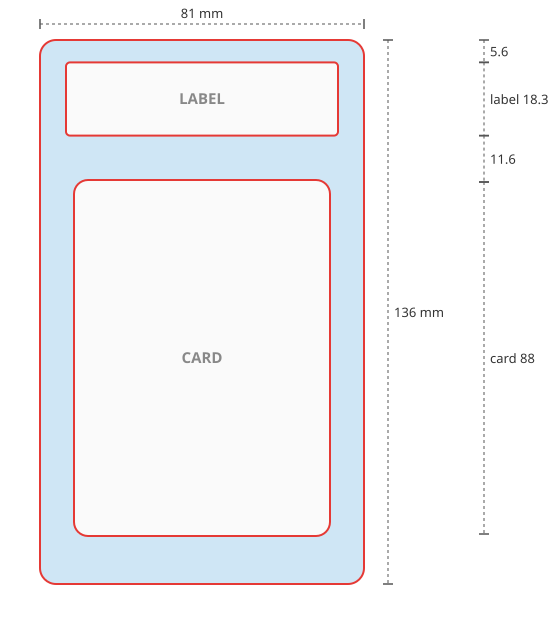

# Pokemon-Extender

**Your favourite card, framed like a graded slab — printed, cut and ready for the acrylic case.**

[](LICENSE)
[](https://github.com/Racoon80/pokemon-extender/pkgs/container/pokemon-extender)
[](#install)

<a href="https://www.buymeacoffee.com/dv7g" target="_blank"></a>

You have a picture of a Pokémon card whose artwork carries on past the card's edge — painted by
hand, or extended with whatever AI tool you like. Pokemon-Extender turns that picture into an insert
for a PSA- or BGS-style acrylic case: a print sheet in the exact size of the slab, with the cut lines
for the outline, the label window and the card window. Print it, let the cutter do its work, put
the real card in the window and the label above it.

It does not paint anything. It finds the card in your picture, uses it as a ruler (a card is
always 63 × 88 mm), and lays the slab around it so the printed card sits exactly where the real one
lies in the case.

- **One upload, one second.** No GPU, no AI model, no account. A small Docker container.
- **Real millimetres.** Everything is measured in mm, from a template you can correct.
- **Made for print-then-cut.** A file that Bambu Suite takes as it is (H2D/H2S with the cutting
  module), plus SVG and DXF for every other cutter.
- **In four languages.** English, Deutsch, Français and Lëtzebuergesch — it follows the browser.

---

## What comes out



For a PSA slab the sheet is **81 × 136 mm**. Three closed shapes are cut, all in one path:

1. **The outline** with rounded corners — the insert itself.
2. **The label window**, 68 × 18.3 mm, 5.6 mm from the top.
3. **The card window**, 0.5 mm larger than the card on every side so the real card slips in,
   35.5 mm from the top — 11.6 mm of picture between label and card, as in the case.

| Download | What it is for |
|---|---|
| **Bambu Suite (SVG)** | The slab as one picture, transparent outside the outline and inside both windows, with its size in mm. Drop it into Bambu Suite, choose *Print Then Cut* — the Suite cuts along the edges by itself. |
| **Print + cut line (SVG)** | Picture and cut path in one file, already aligned, for other cutting software. |
| **PDF / PNG** | The print alone, at exact size with 2 mm bleed. |
| **Cut line only (DXF)** | The cut path alone, for software that wants it separately. |

<br clear="right">

## The picture you upload

- The **whole card** is visible, upright, with background around it on every side. A slight tilt
  is straightened.
- Leave **enough room above the card** for the label: with PSA about 40 % of the card's height.
  What is missing is filled with blurred background, and the page tells you how many mm on which side.
- **Resolution:** at 260 dpi the card needs about 650 × 900 px. Below 200 dpi the page warns that
  the print will be soft.

## Install

### Unraid (Compose Manager plugin)
1. Apps: install **Docker Compose Manager**.
2. Docker → *Compose* → *Add New Stack* → name it `Pokemon-Extender`.
3. *Edit Stack* → *Compose File*: paste [`unraid/docker-compose.yml`](unraid/docker-compose.yml), save.
4. *Compose Up*, then open `http://<unraid-ip>:8000` — or *WebUI* in the Docker tab.

Updates: *Update Stack* pulls the newest image.

### Docker anywhere else (Linux, Windows, macOS, Raspberry Pi)
Put [`docker-compose.yml`](docker-compose.yml) into an empty folder and run

```bash
docker compose up -d
```

then open `http://localhost:8000`. Updates: `docker compose pull && docker compose up -d`.

Without compose:

```bash
docker run -d -p 127.0.0.1:8000:8000 -v ./data:/data ghcr.io/racoon80/pokemon-extender:latest
```

The image is built for `linux/amd64` and `linux/arm64` by GitHub Actions on every push to `main`.
To build it yourself: `docker build -t pokemon-extender .`

> **There is no login.** The default compose file listens on this computer only. Opening it to your
> LAN is fine (`"8000:8000"`); never forward the port to the internet.

## Slab formats

Pick the format on the page (or `--template` on the command line). All values in mm.

| Template | Sheet | Label window | Card |
|---|---|---|---|
| `psa` — PSA | 81 × 136 | 68 × 18.3, 5.6 from the top | 63 × 88, 9 from the left, 35.5 from the top |
| `bgs` — Beckett | 84 × 131 | 63 × 20, 6 from the top | 63 × 88, 10.5 from the left, 31 from the top |

Neither PSA nor Beckett publishes official measurements: the sheet sizes are the most widely quoted
figures, the positions are measured from product photos (PSA) or estimated (BGS). Check them against
your case. To correct a format or add one, put a `*.json` into `templates/` inside the data volume
(Unraid: `/mnt/user/appdata/pokemon-extender/templates/`) — a file there wins over the built-in one
of the same name and is read for every job. The built-in ones are in [`templates/`](templates/).

## Bambu Lab, step by step

1. On the page: upload, choose the template, *Make print + cut line*.
2. Download **Bambu Suite (SVG)**.
3. In **Bambu Suite** (not Bambu Studio — the cutting module lives in the Suite) drag the SVG onto
   the canvas. It arrives at 81 × 136 mm.
4. Set it to **Print Then Cut** and follow the Suite: it prints on your paper printer, then the
   H2D/H2S cuts along the outline and both windows.

The Suite traces the cut from the picture's edges and does not let you edit cut lines by hand,
which is why this file has transparent holes instead of a separate cut line. It also ignores the
dpi of a PNG (one came in 2.28× too large) but keeps the size of an SVG — hence the SVG wrapper.

## How it works

1. **Find the card** — the largest 63:88 rectangle inside the picture, rotation included
   ([`app/card.py`](app/card.py)).
2. **Scale** — card width in pixels ÷ 63 mm.
3. **Lay out** — outline, label and card window from the template, around the card
   ([`app/layout.py`](app/layout.py)).
4. **Resample** the picture to print resolution; fill what is missing; paint over whatever of a
   sharp-cornered card would peek out around the rounded card window
   ([`app/pipeline.py`](app/pipeline.py)).
5. **Write** the print and the cut files ([`app/cutfile.py`](app/cutfile.py)).

## Settings

| Variable | Default | |
|---|---|---|
| `MAX_UPLOAD_MB` | 25 | Largest upload |
| `MAX_JOBS` | 2 | Pictures processed at the same time; more wait up to 30 s, then get *busy* |
| `OUTPUT_TTL_HOURS` | 72 | Results are deleted after this |

## Command line

```bash
docker compose exec pokemon-extender python -m app.cli /data/picture.jpg -o /data/out --template psa
# or locally: pip install -r requirements.txt && python -m app.cli picture.jpg -o out
```

## Licence

Code: MIT ([`LICENSE`](LICENSE)). Pokémon and the card images are © Nintendo / Creatures / GAME
FREAK. This project is not affiliated with them, and the pictures you print are yours to be
responsible for.

If it saved you an afternoon with a craft knife:

<a href="https://www.buymeacoffee.com/dv7g" target="_blank"></a>
